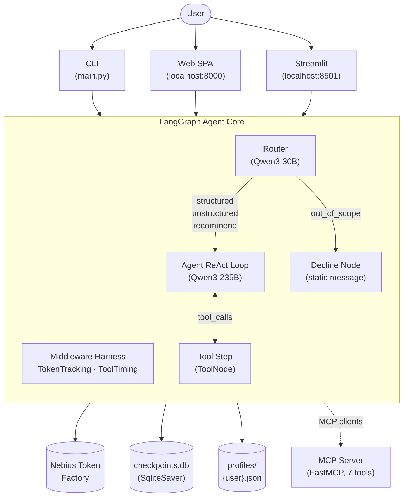
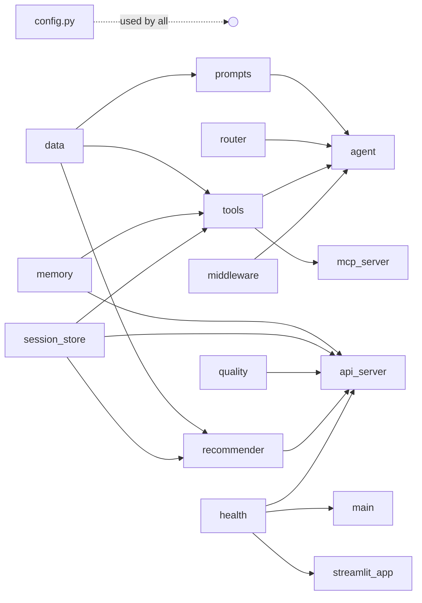
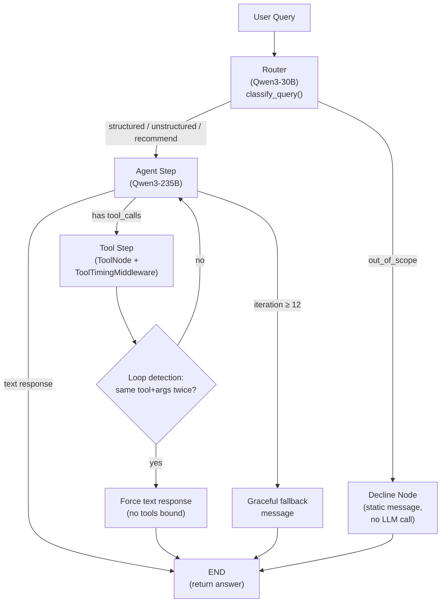
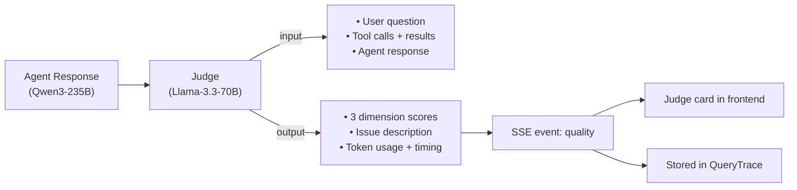
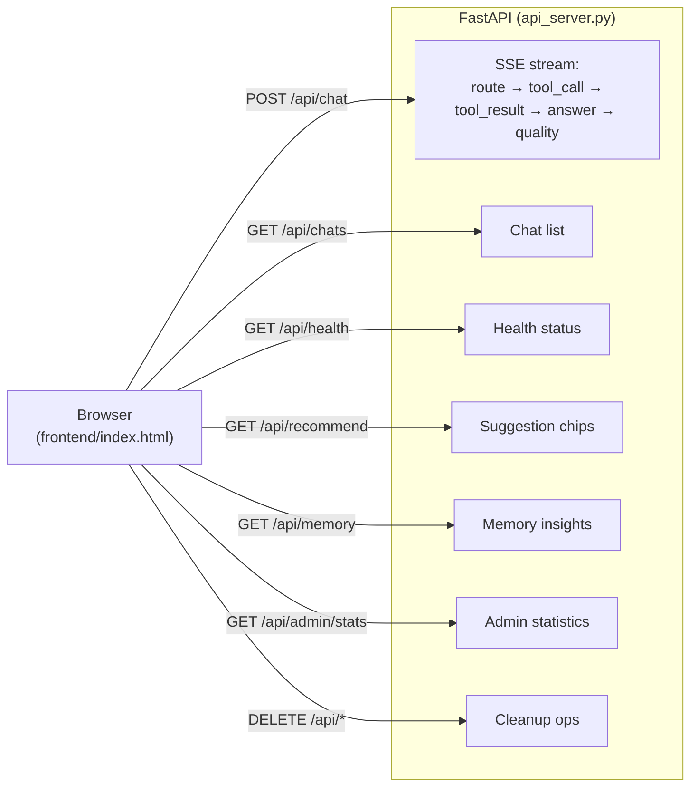
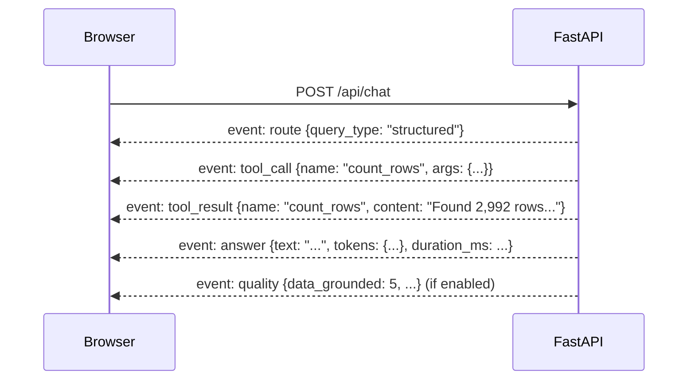

# Architecture Document

## Glossary

| Term | Meaning |
|---|---|
| **ToFa** | Nebius Token Factory — the LLM inference platform providing OpenAI-compatible API for model access |
| **ReAct** | Reasoning + Acting — an agent loop pattern where the LLM reasons, calls a tool, observes the result, and repeats |
| **MCP** | Model Context Protocol — an open standard for exposing tools to LLM clients |
| **SPA** | Single-Page Application — a web app served as one HTML file with client-side rendering |
| **SSE** | Server-Sent Events — HTTP-based unidirectional streaming from server to browser |
| **TOON** | [toonformat.dev](https://toonformat.dev) — a token-efficient tabular format (header once, pipe-delimited rows) |

## Table of Contents

1. [Overview](#1-overview)
2. [System Context](#2-system-context)
3. [Component Diagram](#3-component-diagram)
4. [Agent Flow](#4-agent-flow)
5. [Tools](#5-tools)
6. [Memory Architecture](#6-memory-architecture)
7. [Quality Scoring (Judge)](#7-quality-scoring-judge)
8. [Token Optimization](#8-token-optimization)
9. [Models](#9-models)
10. [Web Frontend Architecture](#10-web-frontend-architecture)
11. [Testing](#11-testing)
12. [Technology Decisions](#12-technology-decisions)
13. [Roadmap](#13-roadmap)

## 1. Overview

This project is a LangGraph-based ReAct agent that answers structured and unstructured questions about the Bitext Customer Service dataset (26,872 rows, 11 categories, 27 intents). The agent classifies queries via a dedicated router model, uses 11 typed tools with Pydantic schemas, persists conversations via SQLite checkpointing, maintains per-user profiles as JSON files, and exposes data tools through an MCP server. A cross-model quality judge (using a different LLM family) evaluates each response. All LLM inference goes through Nebius Token Factory.

The solution is built on LangGraph with a manual ReAct loop (rather than the built-in `create_agent`) to maintain full control over loop detection, iteration limits, and malformed tool-call repair. LangChain's `AgentMiddleware` system provides composable hooks for token tracking and tool timing. Three UI entry points — CLI, custom HTML frontend, and Streamlit — share the same agent graph and middleware backend.

This document describes the architecture, components, and their interactions. Architectural decisions are addressed in Section 12 (Technology Decisions) with reasoning, or are self-evident from context. Known limitations that are acceptable for this POC but would need resolution in a production system, along with points for future development, are summarized in Section 14 (Roadmap).

## 2. System Context



Three UI entry points share one agent graph. The graph calls Nebius Token Factory for all LLM inference (agent, router, judge, summarizer), persists conversations in SQLite, and stores user profiles as JSON files.

External MCP clients can also access the 7 data tools via `src/mcp_server.py` (FastMCP, stdio transport).

## 3. Component Diagram

```
src/
├── config.py          ← Central config, LLM factory, pricing, Zscaler handling
├── data.py            ← Dataset loading + DatasetMetadata (injects into prompts)
├── prompts.py         ← Agent, router, and decline prompt strings
├── router.py          ← Query classifier (ROUTER_MODEL → 4-way classification)
├── agent.py           ← LangGraph StateGraph: router → agent_step ↔ tool_step → END
├── tools.py           ← 11 LangChain tools with Pydantic schemas
├── toon.py            ← TOON output formatter (token-efficient tabular format)
├── memory.py          ← UserProfile CRUD (thread-safe, atomic file writes)
├── middleware.py       ← TokenTrackingMiddleware + ToolTimingMiddleware
├── session_store.py    ← Chat metadata, per-query traces, JSON persistence
├── quality.py         ← Cross-model judge (JUDGE_MODEL scores responses)
├── recommender.py     ← Query suggestion engine (past sessions + profile)
├── health.py          ← Startup diagnostics (dataset, API, persistence)
├── ui_helpers.py      ← Shared formatting (suggestions, tagging, export)
└── mcp_server.py      ← FastMCP server wrapping 7 data tools

Entry points:
├── main.py            ← CLI (--session, --user, --health)
├── api_server.py      ← FastAPI backend (REST + SSE for web frontend)
├── streamlit_app.py   ← Streamlit UI (legacy fallback)
└── frontend/
    └── index.html     ← Single-file SPA (HTML/CSS/JS, no build step)
```

### Key dependencies between modules



## 4. Agent Flow



### Why a manual ReAct loop

LangChain's `create_agent` wraps the ReAct loop in a black-box subgraph. We replaced it with explicit `agent_step ↔ tool_step` nodes because `create_agent` caused two critical failures:

1. **Llama-3.3-70B infinite loops**: the model calls the same tool repeatedly with identical arguments, never producing a final text response, until the recursion limit is hit.
2. **DeepSeek-V3.2 DSML leak**: the Nebius vLLM backend intermittently fails to parse DeepSeek's native tool-call XML format into OpenAI-compatible `tool_calls`, leaking raw XML into the `content` field.

The manual loop gives us loop detection (force text after duplicate tool calls), iteration limits (`MAX_ITERATIONS=12`), and DSML XML repair (parse `<tool_call>JSON</tool_call>` patterns back into proper tool calls).

### Middleware hook invocation

Middleware hooks are called explicitly rather than through `create_agent`'s internal wiring:

- **`TokenTrackingMiddleware.wrap_model_call`**: wraps every LLM invocation in `agent_step` using `ModelRequest` / `ModelResponse` types. Reads `usage_metadata` from the returned `AIMessage` to accumulate per-query and per-session token counts.
- **`ToolTimingMiddleware.wrap_tool_call`**: passed to `ToolNode(wrap_tool_call=...)`. Records wall-clock execution time for each tool call.
- **Message trimming**: `_trim_messages()` keeps the last 30 messages, replacing LLM-based summarization to avoid extra LLM calls. Acceptable for short interactive sessions; a production system would need LLM-based summarization for long conversations (see Roadmap).
- **Tool input bounds**: enforced by Pydantic `Field(ge=, le=)` on tool schemas rather than a separate middleware. Validation runs before the tool function body, rejecting out-of-range values with a clear error.

## 5. Tools

11 tools, dynamically exposed based on router classification:

| # | Tool | Type | Description |
|---|------|------|-------------|
| 1 | `list_categories` | data | All 11 categories (cached) |
| 2 | `list_intents` | data | All 27 intents or filtered by category (cached) |
| 3 | `count_rows` | data | Row count with optional category/intent filter |
| 4 | `get_distribution` | data | Frequency breakdown by category or intent |
| 5 | `get_examples` | data | Random sample of N rows (TOON format, excludes `flags` column) |
| 6 | `search_instructions` | data | Keyword search in customer text (TOON format) |
| 7 | `summarize_responses` | analysis | LLM-powered summary of agent responses for a category/intent |
| 8 | `remember_fact` | memory | Append a distilled fact to the user's profile |
| 9 | `recall_profile` | memory | Read the user's stored profile facts |
| 10 | `update_profile` | memory | Replace entire profile after user confirmation |
| 11 | `recall_past_sessions` | memory | Search session history for past queries and tools used |

### Dynamic tool exposure

The router classification determines which tools the LLM sees on each call. This reduces per-call tool description tokens by ~40% and lowers tool selection noise.

| Query type | Tools exposed | Rationale |
|---|---|---|
| `structured` | data (1–6) + memory (8–11) | Data queries need data tools; memory always available |
| `unstructured` | data (1–6) + analysis (7) + memory (8–11) | Open-ended queries may need LLM summarization |
| `recommend` | memory only (8–11) | Recommendations draw from history and profile, not data |
| `out_of_scope` | none | Decline node returns a static message, no LLM call |

### MCP exposure

`src/mcp_server.py` exposes tools 1–7 via FastMCP (stdio transport). Each MCP tool is a thin wrapper that delegates to the existing LangChain tool via `.invoke()`, ensuring identical behavior.

Memory tools (8–11) are excluded because they require a user ID from `contextvars.ContextVar`, which MCP clients don't provide.

## 6. Memory Architecture

The agent uses four memory layers, following the standard classification from cognitive science (as applied to LLM agents):

| | **Short-term (Working)** | **Episodic** | **Semantic** | **Procedural** |
|---|---|---|---|---|
| **What** | Active conversation context for the current thread | Records of past interactions: queries asked, tools used, durations, quality scores | Distilled facts about users: name, role, interests, preferences | Aggregated usage patterns: tool frequency, query type distribution |
| **Storage** | `checkpoints.db` (SqliteSaver) | `session_store.json` | `profiles/{user}.json` | Computed on demand from session store |
| **Scope** | Per-thread; lost on new session | Cross-thread; retained across all sessions | Cross-thread; retained indefinitely | Cross-thread; retained |
| **Access** | Automatic via LangGraph checkpointer | `recall_past_sessions` tool, Admin tab | `remember_fact`, `recall_profile`, `update_profile` | `/api/memory` endpoint, Memory Insights tab |

### Short-term (working) memory

- **What**: the active conversation history for the current session
- **Storage**: `checkpoints.db` via LangGraph's `SqliteSaver`
- **Scope**: per thread (identified by `thread_id`); a new session starts a new thread
- **Trimming**: last 30 messages kept; older messages silently dropped (not LLM-summarized)
- **Access**: automatic via LangGraph checkpointer — no tool call needed

### Episodic memory

- **What**: records of specific past interactions — which queries were asked, which tools were invoked, how long they took, what quality score they received. Each `QueryTrace` is a timestamped event recording one user-agent interaction.
- **Storage**: `session_store.json` — a JSON file with `ChatMetadata` per conversation and `QueryTrace` per query
- **Scope**: cross-session, per user. Survives across threads and restarts.
- **Access**: the `recall_past_sessions` tool searches this store by keyword or query type. The Admin tab and `/api/admin/stats` endpoint also surface this data.
- **Note**: this is not a full transcript replay — the complete message history lives in the checkpointer (short-term memory). Episodic memory stores metadata and traces about what happened, not the raw messages.

### Semantic memory

- **What**: distilled, stable facts about the user (name, role, interests, preferences) — extracted from conversation by the agent's deliberate use of the `remember_fact` tool
- **Storage**: `profiles/{user_id}.json` — a Pydantic `UserProfile` with a `facts[]` list
- **Scope**: cross-session, per user. Survives indefinitely.
- **Access**: `remember_fact` (write), `recall_profile` (read), `update_profile` (replace)
- **Safety**: `threading.Lock` on `add_fact()` for serialized read-modify-write; atomic writes via `tempfile.NamedTemporaryFile` + `Path.replace()` to prevent corruption

### Procedural memory

- **What**: aggregated usage patterns — which tools the user triggers most, what query types they favor
- **Storage**: computed on demand from the session store (no separate persistence)
- **Scope**: cross-session, per user
- **Access**: `/api/memory` endpoint and the Memory Insights tab in the frontend
- **Note**: in a production system, procedural memory could also encode learned agent behaviors (e.g., "this user prefers concise answers" or "always check refund data first for this user"). Currently it is observational only.

## 7. Quality Scoring (Judge)

Each agent response can be independently evaluated by a cross-model judge. The judge uses a different model family (Llama) than the agent (Qwen) to avoid self-evaluation bias.

### Scoring dimensions

The judge scores each response on three dimensions (1–5 scale):

| Dimension | Score 1 | Score 3 | Score 5 |
|---|---|---|---|
| **data_grounded** | Fabricated or misrepresented data | Mostly accurate with minor liberties | All claims faithfully match tool output |
| **addresses_question** | Completely off-topic or silently substituted different data | Partially answers the question | Directly answers or honestly explains what the dataset cannot provide |
| **conciseness** | Extremely verbose or off-track | Adequate but could be tighter | Concise and focused |

**Overall score** = average of the three dimensions. **Pass threshold**: overall ≥ 3 (configurable via `QUALITY_SCORE_THRESHOLD`).

### Grounding rules

The judge prompt includes specific anti-hallucination instructions:

- If the agent relabels data to match the user's question (e.g., calling "review" intent examples "positive feedback" when the dataset has no sentiment column), that is a grounding failure — score `data_grounded` LOW.
- If the agent recalls a past session that used incorrect labels, perpetuating those labels without correction is still a grounding failure.
- **Exception**: when the agent confirms a profile update and restates facts the user just confirmed, this is conversational grounding, not fabrication.

### Integration



- The agent does not know it is being scored — scoring is a post-processing step.
- Toggleable: server-side via `ENABLE_QUALITY_SCORING` env var, per-request via the `quality_scoring` body field, and via frontend settings toggle.
- Judge card rendered inline beside each bot message in the web frontend.

## 8. Token Optimization

Multiple layers reduce token usage:

| Layer | Mechanism | Savings | Rationale |
|---|---|---|---|
| **TOON format** | `to_toon()` — header once, pipe-delimited rows | 30–60% vs JSON | Multi-record tool outputs are the biggest token sink |
| **Column filtering** | `get_examples` excludes `flags` column | ~20% per row | `flags` column is all empty strings; wastes tokens |
| **Output capping** | `get_distribution` returns top 15 only | Prevents unbounded output | 27 intents × full counts would consume excessive context |
| **Dynamic tool exposure** | Only relevant tools bound per query type | ~40% fewer tool description tokens | The LLM doesn't need to see `summarize_responses` for "how many rows?" |
| **Deterministic caching** | `@lru_cache` on `list_categories`, `list_intents` | Zero recompute on repeated calls | These tools return the same result every time |
| **Message trimming** | Keep last 30 messages (no LLM call for summarization) | Avoids summarizer token cost | Trade-off: early context lost in long conversations |
| **Cheap router** | Qwen3-30B for classification ($0.10/$0.30 per 1M) | 3.3× cheaper than agent model | Classification doesn't need 235B parameters |
| **Economy summarizer** | `SUMMARIZER_STRATEGY=economy` picks cheapest model | Minimizes summarization cost | Defaults to the router model via live pricing lookup |

## 9. Models

All models are accessed via Nebius Token Factory (OpenAI-compatible API at `https://api.studio.nebius.ai/v1/`). Model IDs are configurable via `.env`.

| Role | Model | Price (in/out per 1M tokens) | Rationale |
|---|---|---|---|
| **Agent** | `Qwen/Qwen3-235B-A22B-Instruct-2507` | $0.20 / $0.60 | Reliable tool calling in multi-step ReAct loops. See "Rejected models" below. |
| **Router** | `Qwen/Qwen3-30B-A3B-Instruct-2507` | $0.10 / $0.30 | Fast, cheap 4-way classification. Also used for recommendations and economy summarization. |
| **Judge** | `meta-llama/Llama-3.3-70B-Instruct` | $0.13 / $0.40 | Cross-family evaluation — Llama evaluates Qwen responses, avoiding self-bias. Llama works well for single-shot evaluation (no tool calling needed) but fails in iterative ReAct loops (see below). |

### Rejected models (for the agent role)

| Model | Failure mode | Details |
|---|---|---|
| **DeepSeek-V3.2** | DSML leak bug | The Nebius vLLM/SGLang backend intermittently fails to parse DeepSeek's native DSML tool-call tags into OpenAI-compatible `tool_calls`. Raw XML like `<functioncall>...` leaks into the `content` field while `tool_calls` stays empty. The ReAct loop sees no tool call and treats the XML as the final answer. Known server-side issue. |
| **Llama-3.3-70B** | Infinite tool-calling loops | Inside the ReAct loop, Llama calls a tool, receives the result, then calls the same tool with identical arguments — repeating until the recursion limit. This happens with tools returning multi-line output. Llama works fine for single-shot tasks (hence its use as judge) but cannot sustain a multi-step ReAct loop. |

## 10. Web Frontend Architecture



The frontend is a single-file SPA (~1,865 lines of HTML/CSS/JS). No build step, no framework dependencies. Features:

- **Chat tab**: SSE streaming with expandable reasoning steps, suggestion chips, per-query footer (tokens, duration, tools), memory trace badges, judge card
- **Admin tab**: per-query execution traces, session delete, bulk cleanup
- **Memory Insights tab**: 4-panel dashboard (Short-term/Episodic/Semantic/Procedural)
- **Sidebar**: user picker (combo-box), conversation list with search, theme selector (System/Light/Dark)

### SSE event flow



Note: SSE events are buffered during graph execution and yielded in batch after completion, not streamed token-by-token.

### Concurrency

`SqliteSaver` is single-writer. The FastAPI backend protects concurrent access with `threading.Lock` around `graph.stream()` and retry logic for `get_state()`. This is adequate for a POC; a production system would use `PostgresSaver` (see Roadmap).

## 11. Testing

138 test functions across 8 files:

| File | Tests | Scope |
|---|---|---|
| `test_tools.py` | 27 | All 11 tools, metadata, dynamic tool exposure |
| `test_router.py` | 17 | Classification accuracy (real LLM calls, `@pytest.mark.slow`) |
| `test_agent.py` | 21 | Full graph integration, persistence, profile, multi-step |
| `test_api.py` | 19 | FastAPI endpoints, SSE parsing, isolated temp DB/store |
| `test_ui.py` | 21 | UI helpers, SessionStore, tagging, export |
| `test_mcp.py` | 12 | MCP tool registration and invocation |
| `test_quality.py` | 14 | Judge scoring with mocked LLM responses |
| `test_connectivity.py` | 7 | Nebius API connectivity, tool calling, TOON |

Tests marked `@pytest.mark.slow` call real LLMs and require a valid API key. Fast tests (~120) use mocking and run in ~10 seconds.

## 12. Technology Decisions

| Decision | Choice | Rationale |
|---|---|---|
| **Agent framework** | LangGraph `StateGraph` + manual ReAct loop | `create_agent` is a black box that caused infinite loops with Llama and can't handle DSML leak. Manual loop provides loop detection, iteration limits, and DSML repair. |
| **Agent model** | Qwen3-235B | Only model family with reliable tool calling on Nebius Token Factory. DeepSeek and Llama both failed systematic testing (see Section 9). |
| **Router as separate model** | Qwen3-30B (cheaper, faster) | Classification doesn't need 235B parameters. 3.3× cheaper, 2.6× faster. |
| **Middleware pattern** | LangChain `AgentMiddleware` subclasses (`langchain>=1.3.0`) | Native, composable, typed request/response objects. Hooks called explicitly because we own the ReAct loop. |
| **Tool output format** | TOON | 30–60% token reduction for tabular data vs JSON. Validated in connectivity tests that models correctly parse TOON. |
| **Memory pattern** | Memory as tools (agent calls `remember_fact` when relevant) | Agent decides when to save; zero token overhead on turns without personal info. Alternative (background extraction on every turn) wastes tokens. |
| **Profile storage** | JSON files per user | Simple, human-readable, grader-inspectable. No DB dependency beyond SQLite. A production system would use a proper store (see Roadmap). |
| **Conversation persistence** | `SqliteSaver` | File-based, survives restarts, no external DB needed. Single-writer limitation acceptable for POC. |
| **Web UI** | Custom HTML/CSS/JS SPA + FastAPI | Full UI/UX control: SSE streaming, Memory Insights dashboard, theme selector. No build step. Chainlit was dropped (abandoned project, CVEs). Streamlit retained as fallback. |
| **Tool input bounds** | Pydantic `Field(ge=, le=)` on schemas | Validation runs before the tool function body; a separate middleware would be redundant. |
| **User ID injection** | `contextvars.ContextVar` | Thread-safe (concurrent FastAPI requests) + async-safe. No global variable collision. |
| **Quality scoring** | Cross-model judge (Llama judges Qwen) | Different model family prevents self-bias. Judge doesn't need tool calling (single-shot evaluation). |
| **SSL / proxy handling** | Auto-detect Zscaler via `.pem` file presence | Zero-config for graders (no `.pem` → standard SSL). Secure bypass for corporate proxy environments. |
| **Summarizer model** | Configurable via `SUMMARIZER_STRATEGY` env var | Default "economy" picks cheapest available model via live `/v1/models?verbose=true` pricing. |
| **MCP server** | FastMCP v3 with thin wrappers delegating to LangChain tools | Reuses existing tested implementations; `.invoke()` ensures identical behavior. Memory tools excluded (need agent-level user context). |

## 13. Roadmap

Known limitations of this POC and points for future development.

### Production-readiness

| Area | Current (POC) | Production target |
|---|---|---|
| **Database** | `SqliteSaver` — single-writer, file-based, no concurrent access | `PostgresSaver` with connection pooling. Enables concurrent requests, horizontal scaling, and proper backup. |
| **Session store** | JSON file (`session_store.json`) — single-process, no locking | Database-backed store (PostgreSQL or LangGraph `BaseStore`). |
| **Profile storage** | JSON files in `profiles/` | Database-backed with versioning, or LangGraph `BaseStore` with semantic search via embeddings (e.g., `Qwen3-Embedding-8B` on Token Factory). |
| **Web server** | Single-process FastAPI with `threading.Lock` | Multi-worker deployment (Gunicorn + Uvicorn workers) behind a reverse proxy. |
| **Authentication** | None — user ID is client-supplied | OAuth/OIDC or API key authentication. |
| **SSE streaming** | Batched after graph completion | True per-token streaming using LangGraph `astream_events()`. |

### Memory improvements

| Improvement | Description |
|---|---|
| **LLM-based conversation summarization** | Replace message trimming with `SummarizationMiddleware` or a custom summarizer node for long conversations where early context matters. |
| **Semantic memory via Mem0** | Replace JSON profiles with [Mem0](https://github.com/mem0ai/mem0) for automatic memory extraction, semantic deduplication, and embedding-based recall. |
| **Episodic memory compaction** | Periodically summarize old `QueryTrace` records to prevent unbounded growth of `session_store.json`. |
| **Procedural memory as agent behavior** | Extend procedural memory from observational (tool counts) to behavioral — e.g., "this user prefers concise tables over prose" influencing the system prompt. |

### Agent improvements

| Improvement | Description |
|---|---|
| **Auto-retry on low quality score** | `build_retry_prompt()` exists in `quality.py` but is not wired. When the judge scores low, automatically retry the query with feedback. |
| **Multi-model fallback** | If the primary agent model fails or is slow, automatically fall back to `FALLBACK_AGENT_MODEL` (Qwen3-30B). Config exists but not wired into runtime. |
| **Evaluation pipeline** | Benchmark multiple Nebius models on a fixed test suite with the judge scoring each. Produces per-model quality and cost reports. |
| **Streaming token-level** | Current SSE is step-level (events emitted per tool call). True token-level streaming would improve perceived latency. |
